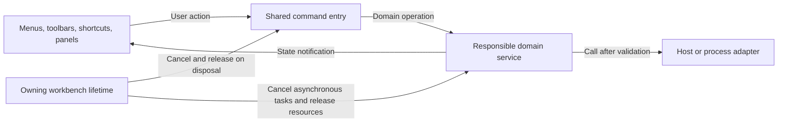

[Chinese](workspace_architecture.md)

# Workbench Responsibilities and Unified Management

Only one business entry exists for the same operation. Menus, keyboard shortcuts, and different panels can be independently presented. This convention applies throughout the workbench: files, search, outline, Git, terminal, and window management all follow this; they do not need to use the same interface, nor are these domains synthesized into a single manager.

## Call Direction and State Owner

| Responsibility | Current Owner | How should the interface be used |
| --- | --- | --- |
| First Display and Persistent Initialization | Static `runtime_head` readiness marker, `workspace_startup` lifecycle | Release the first content after interface mounting; if failed or timeout, restore native; highlight is not a layout prerequisite, see [Sequence Design](startup_stability.en.md) |
| Sidebar Current Content | Active Panel and Displayed Panel of the Core Sidebar | Visible area switch only transfers content; repeated show does not re-mount, remove when cleaning all owners |
| Workspace Session | `workspace_files` arrangement, session service persisted by root directory | Before switching, protect draft and save old session, after canceling old request, restore new root; empty session does not roll back recent files, see [Session Design](workspace_switch.en.md) |
| Current Mounted Folder | Typora `File.getMountFolder()`, provided by file service for reading entry | Directory switching goes through host adapter; tree, search, and terminal do not each cache a global directory |
| File Content, Saved Baseline, and Draft | `workspace_files`、`workspace_text_document` | File menu, keyboard shortcuts, Explorer call the same service; cannot directly overwrite disk or bypass draft checks |
| Open, Save, Restore, and Close Commands | `workspace_file_commands` | Top bar and keyboard shortcuts use already registered commands; internal commands that need path parameters are not shown in the command panel |
| System File Selection Window | `workspace_open_dialog` | Unified handling of cancellation, concurrent selection, and uninstalled late results; use verified Typora API |
| File Creation, Move, Copy, and Trash | Existing file operations service, orchestrated by `workspace_files` | Explorer menu only provides selection and action, does not re-implement writing and conflict judgment |
| Expansion, selection, and visible lines of the file tree | `workspace_file_tree` | Resource manager and remote selector share node cache, lazy loading, keyboard and virtual line; Explorer adapts to the host sidebar, selector only manages entering directory and confirming draft. Selection is not equal to opening, the selector that cannot respond to the host file listener cannot automatically register monitoring or file writing operations, see [R070.8](remote_ssh.en.md#section_2c24b467a014) |
| Search session | `workspace_search_engine`, search controller | Search UI settings scope and consume progressive results; identity change cancels old results, literal directory scope does not impersonate glob |
| Code outline | Outline controller and corresponding parsing service | C/C++ uses clangd; Markdown retains title service; display and parsing lifecycle are separately managed |
| SCM toolbar, repository list and menu | `git_scm_toolbar`、`git_scm_repositories`、`git_scm_menus` | The same controller holds the current writable repository; summary is read-only, switch repository cancels, button / more / shortcut shares action status, see [SCM design](git_scm_actions.en.md#section_e0153cf15781) |
| Git operations and difference documents | Git runner, repository model and difference view | History version identity comes from Git document, cannot be guessed as the current version of the workspace by the 'open file' button |
| Editor navigation history | `reading_history`, `reading_navigation` and domain navigation port | Editable document content, source code, read-only version and difference all enter the main navigation as resource/version/group identity; view provides location and re-open ability, does not bind globally Alt key separately. Floating preview is isolated by session, function panel does not fabricate file records, see [Classification and Access Contract](navigation_history.en.md#section_0abe526f1e80) |
| Markdown reading skin | `workspace_markdown_theme` shares valid theme rules, document content inherits values and invalid notification | Search/link, Git history and rendering comparison access the same adapter; domain only maintains layout and business coloring, does not fix cover theme font, title and table. Scroll does not re-extract CSS, see [R034.3](git_markdown_diff.en.md#section_f1c2e4af19b5) |
| Terminal process and buffer | `terminal_session` manages process, `terminal_surface` manages xterm | Move or hide view reuse the same instance; termination is executed by session coordinator |
| Terminal configuration and panel geometry | `terminal_settings` with `terminal_panel` | Validate the overall configuration and notify the view; the geometry module only adjusts the occupied space, not manages the Shell |
| Instant hover and keyboard focus | `workspace_interaction` | Factory default connection, view registration in the root scope; the geometry and business state are owned by UI, local differences are expressed through role/variable/independent boundary |
| Inline content centering | `workspace_inline_layout` | Tags and status bar jointly center the actual text and icons, each maintaining their own area height, width, and truncation |
| Delayed information card | `workspace_hover`、`workspace_hover_surface` | Jointly responsible for default delay, boundary, focus, and cleanup; the domain provides content, cancellation signal response and local timing, see [Interaction Contract](workspace_interaction.en.md) |
| Status bar geometry | `workspace_footer_layout` shares layout group, operations, and text roles | Native adapter declares and restores roles; Git, file actions, margins, word count, language and source code/diff status only maintain their own content and width, see [Status Bar Contract](statusbar_layout.en.md#section_6cb040c104ad) |
| View check and native tool bar | `workspace_view_state` reads host/sidebar, `workspace_native_toolbar` limits reading area | Menu reads actual visible state, commands are executed by native owner, not by menu cache replacing native state |
| Terminal menu state | `terminal_workspace` provides real-time read-only query via `terminal_state` | Top menu and domain coordinator share session identity and panel state; old menu actions cannot operate on later sessions |
| Window zoom | Typora native zoom state, `workspace_zoom` unifies command adaptation | Menu and global keyboard shortcuts call the same entry; terminal and editor do not maintain their own window proportions, see [Zoom Design](workspace_zoom.en.md) |
| Window and tab handover | `workspace_detached_window` with file snapshot service | Drag and drop handles the target position; confirmation of reception and source identity determines when to release the source |
| Listeners, timers, commands and DOM | Each bound function's `workspace_lifetime` | Initialization failure and normal uninstallation follow the same cleanup path, and cleanup can be called repeatedly |

## Abstract usage boundary

The command pattern is used to eliminate the divergence of multiple operation entry points; the adapter isolates the interfaces of Typora, the file system, and PTY; the observation notification allows independent interfaces to follow the state; the lifecycle composition is responsible for cleanup. Whether to extract abstraction should be based on the actual shared responsibilities and states, not just based on similar function names.

When adding new features, clearly define who holds the state, who has the right to modify it, and when asynchronous results become invalid. View switching only changes the presentation; restart, termination, saving, overwriting, or cross-window release must have clear business actions. Errors should retain the existing document content and configuration, and provide feedback on the actual failure cause. When temporary menus, settings, and dialog boxes are closed, notify their respective modules immediately and release references. Uninstallation should only clean up still open interfaces and should not allow closed menus to hold old sessions and output buffers.

## Requirement and verification closed loop

Developers first read [AGENTS.md](../AGENTS.en.md), [Requirement Design Index](requirements_design.en.md), and local `.cache/issue_tracking/requirements.md`. Each piece of feedback is first registered with an ID, source, original intent, and acceptance conditions, then linked to the formal design section; design is supplemented before implementation, and subsequent clarifications and implementation adjustments are updated synchronously, and cannot replace other unfinished items. Completed records also include verification evidence, installation status, and commit status.

Formal index manages requirement numbers and design entry points; corresponding domain documents maintain unique design content, including interaction, responsibilities and status, failure and cancellation, implementation trade-offs and acceptance methods. Minor fixes update existing sections, related requirements can share documents. Design coverage and implementation progress are independent; pending design, partially implemented, and items not verified in this session are retained as gaps.

Local ledger does not enter Git, only manages execution progress and current evidence; design documents are maintained with version, [Design Baseline](vscode_design_baseline.en.md) records upstream sources, [Feedback Records](feedback_review.en.md) save delivery history. At the end, each item is checked one by one for requirements, design, implementation, verification, and delivery; no independent completion list is created across multiple documents.

## Module refresh and input isolation (R071)

Data waiting, write transactions, and cancellation belong to the corresponding service; views only display local progress. After form confirmation is accepted, global focus/mask is released, and the true writing transaction continues to complete. Different modules cannot share the "full window busy" status. Large lists retain complete models, only draw visible rows. Multiple entry points share completion notifications for the same refresh, do not establish a set of polling for each entry. Initial configuration reading and repository discovery use asynchronous IO. Implementation, repository lifecycle, and cross-module responsiveness acceptance are seen in [Module Refresh Isolation](workspace_responsiveness.en.md).
