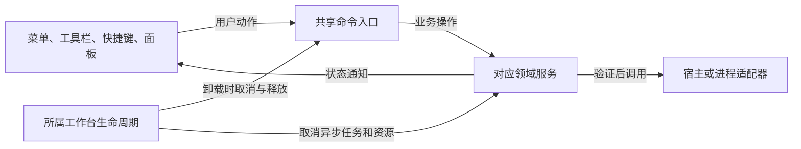

# 工作台职责与统一管理

同一操作只有一个业务入口，菜单、快捷键和不同面板可以独立呈现。这个约定适用于整个工作台：文件、搜索、大纲、Git、终端和窗口管理均遵守；不要求它们使用同一种界面，也不把这些领域合成一个管理器。

## 调用方向与状态所有者

| 职责 | 当前所有者 | 界面应怎样使用 |
| --- | --- | --- |
| 当前挂载文件夹 | Typora `File.getMountFolder()`，由文件服务提供读取入口 | 目录切换经过宿主适配器；树、搜索和终端不各自缓存一份全局目录 |
| 文件正文、保存基线和草稿 | `workspace_files`、`workspace_text_document` | 文件菜单、快捷键、Explorer 调用同一服务；不能直接覆盖磁盘或绕过草稿检查 |
| 打开、保存、还原、关闭命令 | `workspace_file_commands` | 顶栏和快捷键使用已注册命令；需要路径参数的内部命令不出现在命令面板 |
| 系统选择窗口 | `workspace_open_dialog` | 统一处理取消、并发选择和卸载后的迟到结果；使用已核对的 Typora API |
| 文件创建、移动、复制和回收站 | 既有文件操作服务，由 `workspace_files` 编排 | Explorer 菜单仅提供选择与动作，不重复实现写入与冲突判断 |
| 搜索会话 | `workspace_search_engine`、搜索控制器 | 搜索 UI 设置范围并消费渐进结果；身份变化取消旧结果，字面目录范围不冒充 glob |
| 代码大纲 | 大纲控制器与相应解析服务 | C/C++ 使用 clangd；Markdown 保留标题服务；展示与解析生命周期分别管理 |
| Git 操作与差异文档 | Git runner、仓库模型与差异视图 | 历史版本身份来自 Git 文档，不能由“打开文件”按钮猜测为工作区当前版本 |
| 终端进程和缓冲 | `terminal_session` 管进程，`terminal_surface` 管 xterm | 移动或隐藏视图复用同一实例；终止由会话协调器执行 |
| 终端配置与面板几何 | `terminal_settings` 与 `terminal_panel` | 配置整体校验并通知视图；几何模块只调整占用空间，不管理 Shell |
| 底栏几何 | `workspace_footer_layout` 共用布局组、操作和文本角色 | 原生适配器声明并恢复角色；Git、文件动作、边距、字数、语言和源码/diff状态只维护自己的内容与宽度，详见[底栏契约](statusbar_layout.md#r0081-统一底栏布局契约) |
| 视图勾选与原生工具栏 | `workspace_view_state` 读取宿主/侧栏，`workspace_native_toolbar` 限定阅读区域 | 菜单读取实际可见状态，命令经原所有者执行，不以菜单缓存替代原生状态 |
| 终端菜单状态 | `terminal_workspace` 经 `terminal_state` 提供实时只读查询 | 顶部菜单与领域协调器共享会话身份及面板状态；旧菜单动作不得操作后来的会话 |
| 窗口缩放 | Typora 原生缩放状态，`workspace_zoom` 统一命令适配 | 菜单与全局快捷键调用同一入口；终端与编辑器不各自维护窗口比例，详见[缩放设计](workspace_zoom.md) |
| 窗口与标签移交 | `workspace_detached_window` 与文件快照服务 | 拖放负责目标位置；接收确认和来源身份复查决定何时释放来源 |
| 监听器、定时任务、命令与 DOM | 各绑定函数的 `workspace_lifetime` | 初始化失败与正常卸载走同一清理路径，清理可以重复调用 |

## 抽象的使用边界

命令模式用于消除多个操作入口的分歧；适配器隔离 Typora、文件系统和 PTY 的接口；观察通知让独立界面跟随状态；生命周期组合负责清理。是否提取抽象，以真实共享的职责和状态为依据，不仅依据函数名称相似。

新增功能先明确谁持有状态、谁有权修改、异步结果何时失效。视图切换只改变呈现；重启、终止、保存、覆盖或跨窗释放必须有明确的业务动作。错误保留现有正文和配置，并反馈实际失败原因。临时菜单、设置及对话框关闭时通知所属模块，立即解除引用；卸载只清理仍打开的界面，不能让已关闭菜单一直持有旧会话和输出缓冲。

## 需求与验证闭环

开发者首先读取 [AGENTS.md](../AGENTS.md)、[需求设计索引](requirements_design.md) 和本地 `.cache/issue_tracking/requirements.md`。每条反馈先登记编号、来源、原意和验收条件，再关联正式设计章节；实施前补充设计，后续澄清及实现调整同步更新，不能替换其他未完成项。完成记录同时写验证证据、安装状态与提交状态。

正式索引管理需求编号与设计入口；对应领域文档维护唯一设计正文，包含交互、职责与状态、失败及取消、实现取舍和验收方法。小修复更新已有小节，相关需求可共享文档。设计覆盖与实现进度独立；待设计、部分实现及未经本次验证的项均保留缺口。

本地台账不进入 Git，只管理执行进度及当次证据；设计文档随版本维护，[设计基线](vscode_design_baseline.md)记录上游来源，[反馈记录](feedback_review.md)保存交付历史。收尾逐项核对需求、设计、实现、验证和交付；不在多个文档复制独立的完成清单。
