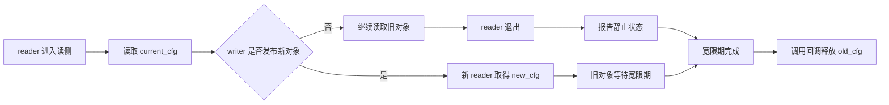

# Typora C 与 Mermaid 增强验收

```c
#include <linux/rcupdate.h>

struct demo_cfg {
    int generation;
    struct rcu_head rcu;
};

static struct demo_cfg __rcu *current_cfg;

static void publish_cfg(struct demo_cfg *new_cfg)
{
    struct demo_cfg *old_cfg;

    old_cfg = rcu_replace_pointer(current_cfg, new_cfg, true);
    if (old_cfg != NULL)
        call_rcu(&old_cfg->rcu, demo_cfg_free_rcu);
}

static int read_generation(void)
{
    const struct demo_cfg *cfg;
    int generation = -1;

    rcu_read_lock();
    cfg = rcu_dereference(current_cfg);
    if (cfg != NULL)
        generation = cfg->generation;
    rcu_read_unlock();

    return generation;
}

static void replace_generation(int generation)
{
    struct demo_cfg *new_cfg;

    new_cfg = kzalloc(sizeof(*new_cfg), GFP_KERNEL);
    if (new_cfg == NULL)
        return;

    new_cfg->generation = generation;
    publish_cfg(new_cfg);
}

static void clear_generation(void)
{
    struct demo_cfg *old_cfg;

    old_cfg = rcu_replace_pointer(current_cfg, NULL, true);
    if (old_cfg != NULL)
        call_rcu(&old_cfg->rcu, demo_cfg_free_rcu);
}
```


