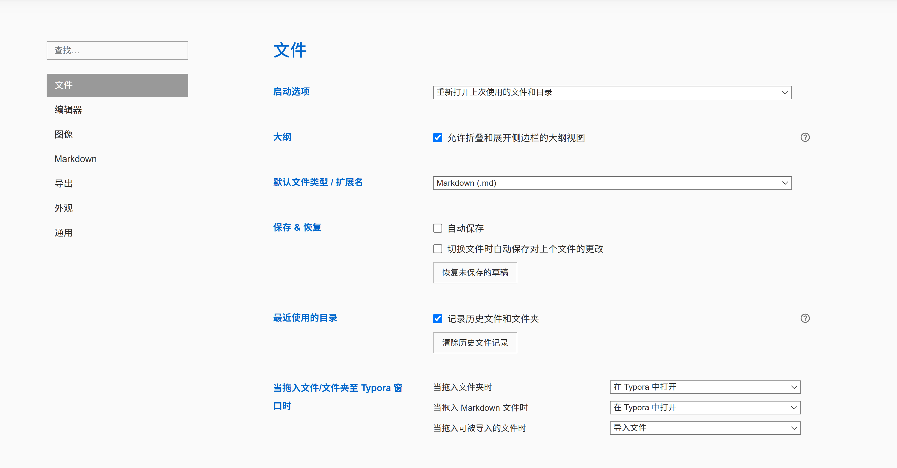
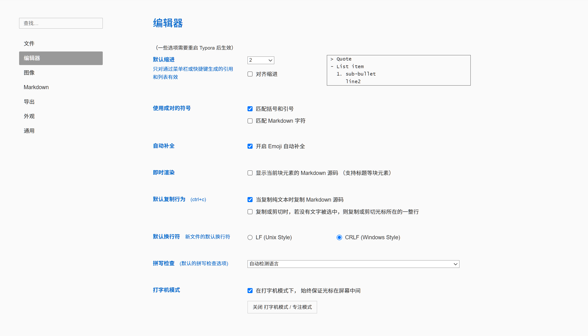
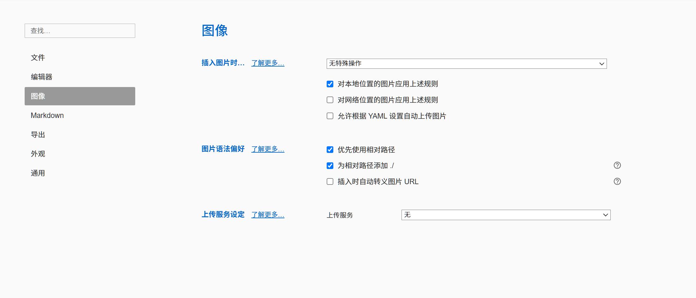
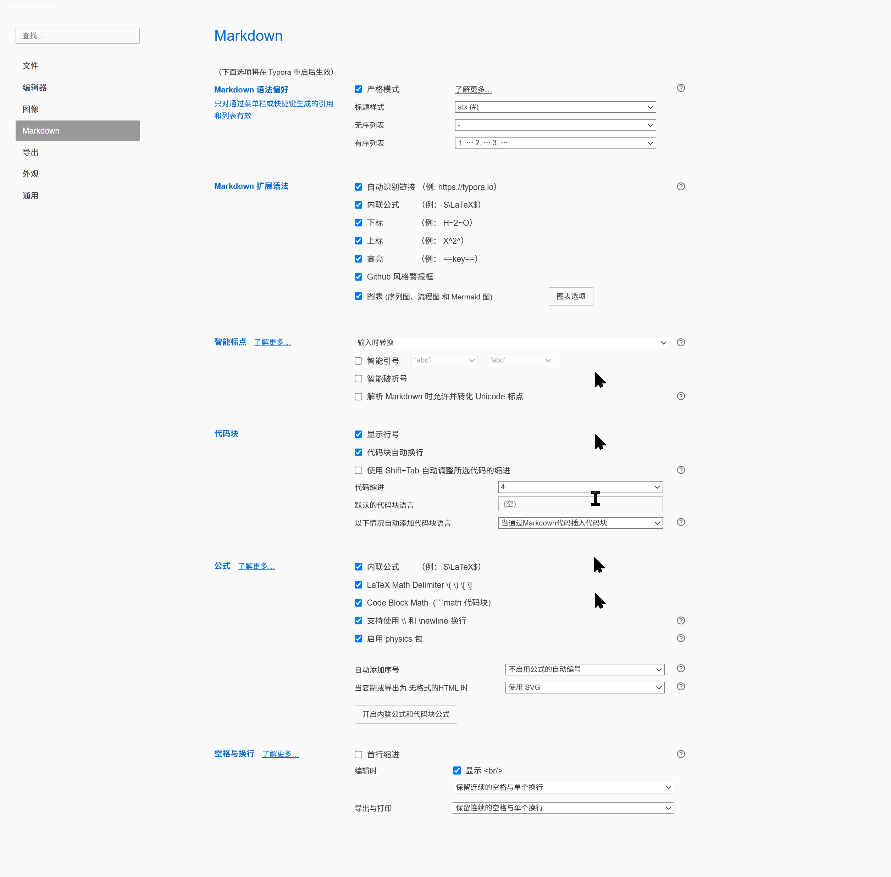
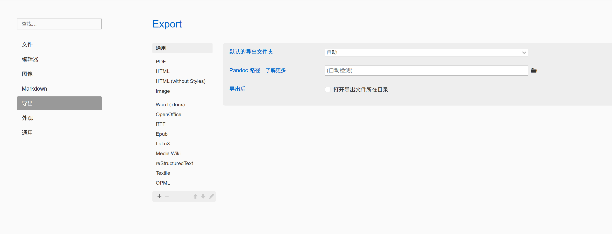
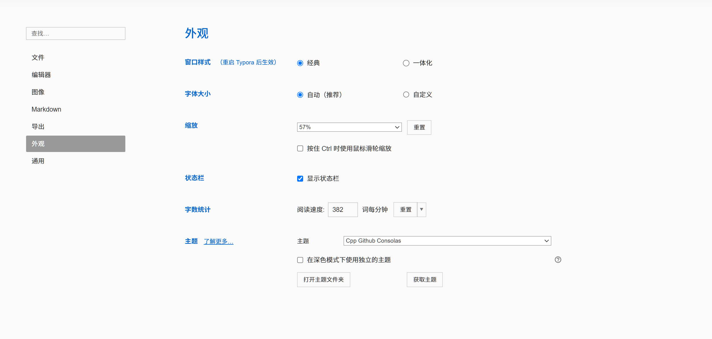
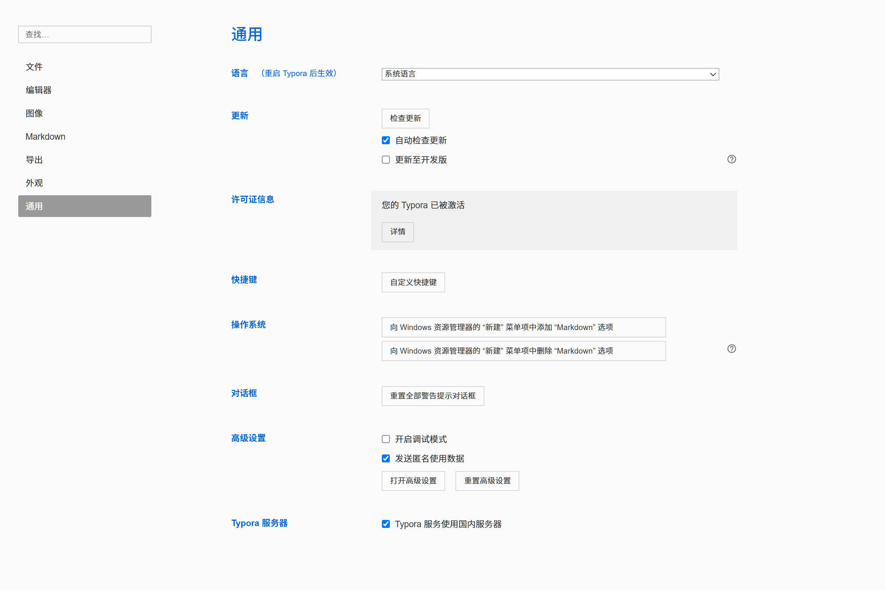

[Chinese](typora配置展示.md)

This page preserves the seven original screenshots of Typora native preferences in Chinese as historical references. Current workbench and community extension entry points are defined by the [feature matrix](docs/workbench_parity.en.md) and [unified settings design](docs/workspace_settings.en.md). Start installation from [Typora installation and workbench](README.md#install-on-windows); current verification and historical records are in the [feedback review](docs/feedback_review.en.md).

The lower-left gear and Ctrl+, open unified Settings. Use its Typora Preferences category for native preferences. Configure the clangd executable, project compilation database, and fallback arguments through [parsing environment settings](docs/source_outline.en.md#section_1df7a9625a19). The status bar retains the Markdown margin slider and its saved value, from 0% to 24% per side. These historical screenshots do not represent current workbench entry points, plugin capabilities, or installation state.

# Chapter 1\_File

---

# Chapter 2 _ Editor

---

# Chapter 3 _ Images

---

# Chapter 4 _ Markdown

---

# Chapter 5 _ Export

---

# Chapter 6 _ Appearance

---

# Chapter 7 _ General

