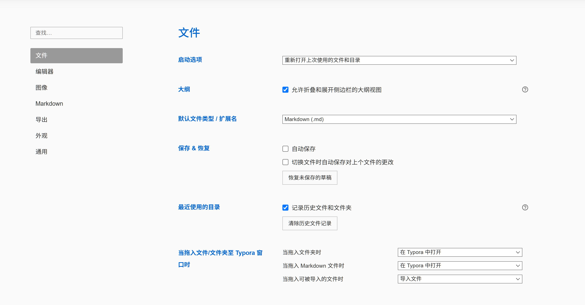
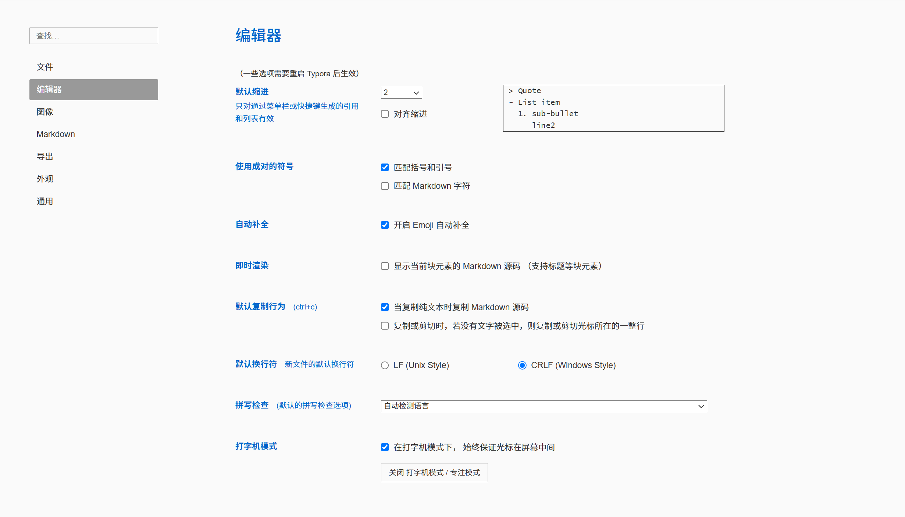
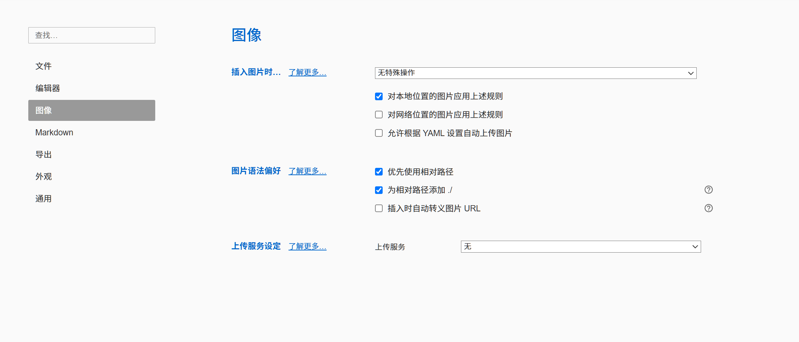
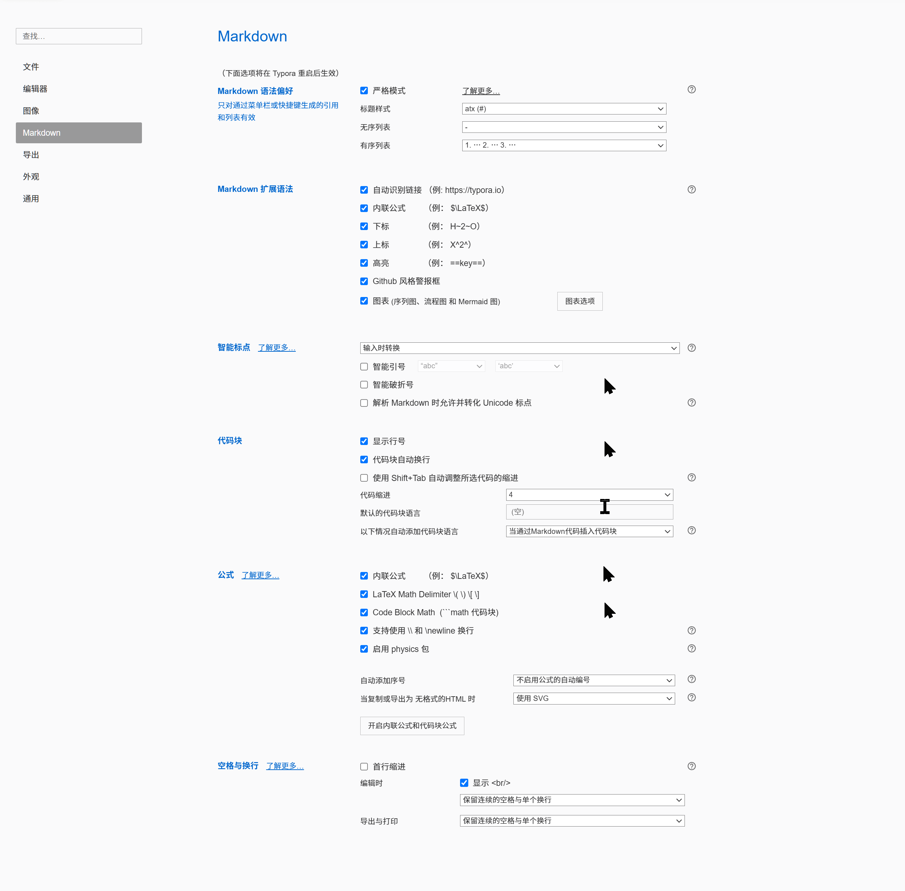
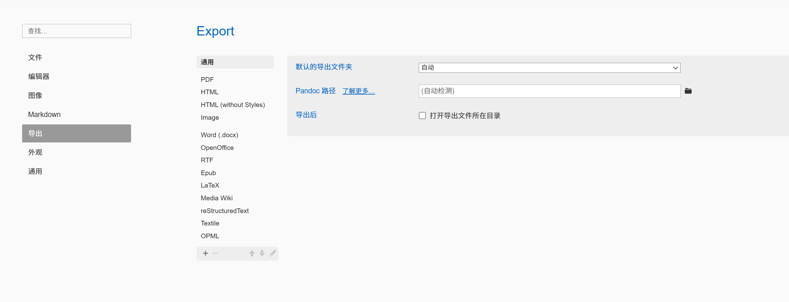
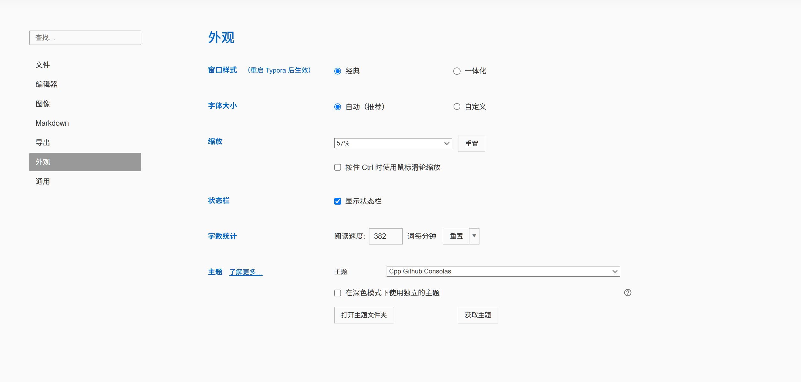
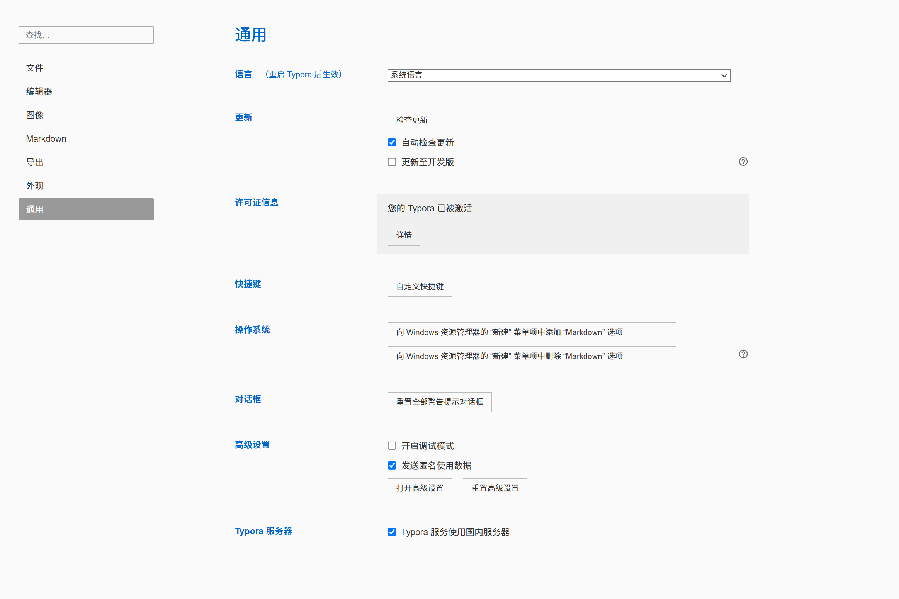

本页保留原有七组 Typora 原生偏好设置截图，作为历史界面参考。当前工作台的标签、分栏、阅读导航、文件识别与代码大纲由常驻增强提供，不包含插件管理器或市场。安装从[Typora 安装与阅读工作区](./README.md#1.1_安装、检查与恢复)进入，状态以[只读检查](./typora配置修改.md#6.5_只读状态检查)为准，当前验证与历史记录见[反馈复查记录](./docs/feedback_review.md)。

左下角齿轮仍打开 Typora 原生偏好设置。代码大纲的 clangd 路径、项目编译数据库和后备参数从[解析环境设置](./docs/source_outline.md#配置入口)配置；Markdown 单侧0%～24%的边距滑块位于底栏，沿用已有保存值，不恢复整套外观设置页。下列截图不代表这些工作台入口或当前安装状态。[大目录搜索](./docs/search_performance.md)和[标签拖动及独立窗口](./docs/drag_and_windows.md)使用工作台入口；它们不会在这些历史偏好截图中新增配置页。

# 第1章\_文件

---

# 第2章\_编辑器

---

# 第3章\_图像

---

# 第4章\_Markdown

---

# 第5章\_导出

---

# 第6章\_外观

---

# 第7章\_通用

